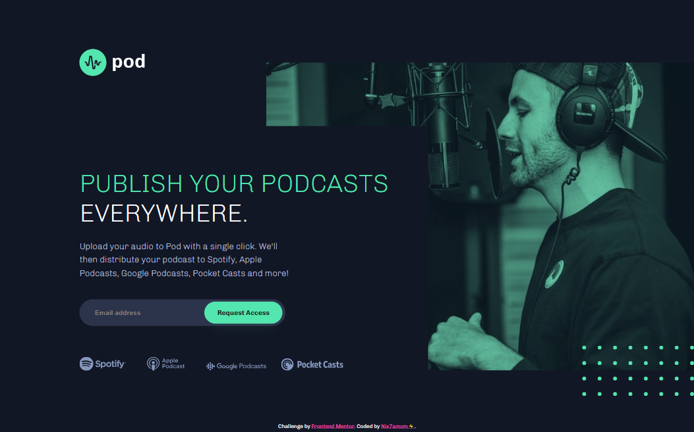
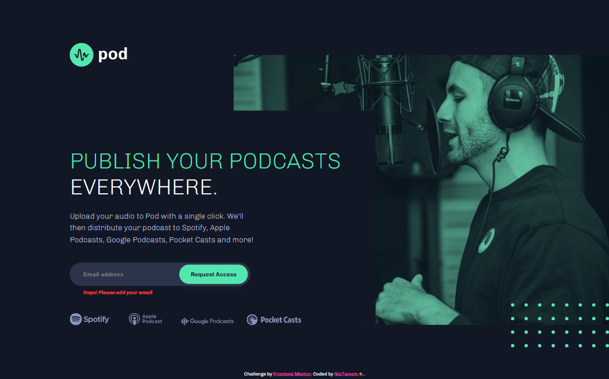
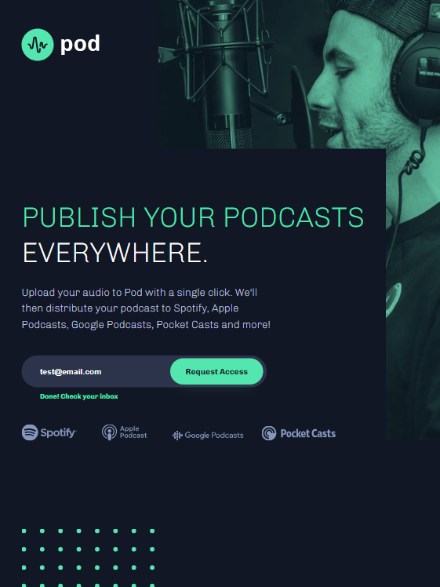

# Frontend Mentor - Pod request access landing page solution

This is my solution to the [Pod request access landing page challenge on Frontend Mentor](https://www.frontendmentor.io/challenges/pod-request-access-landing-page-eyTmdkLSG). 

## Table of contents

- [Overview](#overview)
  - [Challenge Requirements](#challenge-requirements)
- [Screenshots](#screenshots)
- [Links](#links)
- [My process](#my-process)
  - [Built with](#built-with)
  - [What I learned](#what-i-learned)
  - [Useful resources](#useful-resources)
- [Author](#author)

---

## Overview

👩🏻‍💻 [Frontend Mentor](www.frontendmentor.io) challenges help you improve your coding skills by building realistic projects.

⚡ This challenge was to build an early access landing page that includes custom form validation.

🚀 I built this using HTML, CSS and Vanilla JS, with the help of [Figma](https://www.figma.com) for studying the design.

### Challenge Requirements

Users should be able to:

- View the optimal layout depending on their device's screen size
- See hover states for interactive elements
- Receive an error message when the form is submitted if:
  - The `Email address` field is empty should show "Oops! Please add your email"
  - The email is not formatted correctly should show "Oops! Please check your email"

---

## Screenshots

---

## Links

- Solution URL: [frontendmentor.io/solutions/pod-request-access-landing-page-AN0Cz7pfQ5](https://www.frontendmentor.io/solutions/pod-request-access-landing-page-AN0Cz7pfQ5)
- Live Site URL: [nix7amcm.github.io/FEM-pod-request-access-landing-page/](https://nix7amcm.github.io/FEM-pod-request-access-landing-page/)

---

## My process

### Built with

- Semantic HTML5 markup
- CSS custom properties
- Flexbox
- Vanilla JS

### What I learned

For this project, I aimed to practice positioning elements without relying on Grid or Flexbox, making it a straightforward exercise. I only introduced flexbox to the `body` at the end when adding the footer attribution to ensure it stays at the bottom of the page, separating it from the `main` content, while keeping it easily visible and accessible.

I adopted a desktop-first styling approach, which I'm most familiar with at the moment. However, I plan to explore a mobile-first approach in future projects, recognizing its growing popularity. To achieve responsiveness, I employed CSS media queries to adjust styles, visibility, positions, and content based on screen size, from large desktop displays to small mobile screens. My attention to detail was crucial in maintaining a consistent and user-friendly design across all devices. Instead of relying solely on fixed sizes from the design file, I opted for scalability by using the CSS `clamp()` function for text and some padding, enhancing the page's responsiveness.

I applied the mask images to the backgrounds using `::before` pseudo-classes and used `transform: translate()` to offset elements appropriately. Although there are various approaches to handling layout and responsiveness in this design, I challenged myself to avoid using Flexbox and Grid. While it was initially tricky, I persevered and am happy with the result.

I honed my DOM manipulation skills with Vanilla JS, adding logic to interact with the `.messages` elements in the `form`. Event listeners and Regex functions ensured that the messages remained hidden, and the relevant message displays based on the submitted value. Additionally, I included an extra message for successful email submissions to improve accessibility and usability for all users.

This project provided an excellent opportunity to practice and enhance a wide range of skills.

### Useful resources

- [Clamp calculator](https://www.marcbacon.com/tools/clamp-calculator/ ) - This tool is fantastic for swiftly calculating `clamp()` values. You input the minimum and maximum values for the desired viewport range and target values, and it instantly generates the code for you. Just click 'copy' to grab it. Furthermore, there's a built-in font test for you to check the result. You also have the flexibility to enter your values in either `px` or `rem` and adjust the base starting from `16px`. It truly streamlines the process and conserves both time and mental effort!

- [Media Queries Cheat Sheet](https://gist.github.com/bartholomej/8415655) - I frequently refer to this for media queries. It's extensive, easy to follow and overall a great resource to have in your bookmarks for quick reference!

- [Hex Color To CSS Filter Converter](https://isotropic.co/tool/hex-color-to-css-filter/) - I found this fantastic tool for converting any hex colour into its matching `filter` property. Another great resource for the arsenal!

---

## Author

- Website - [Nix7amcm](https://github.com/Nix7amcm)
- Frontend Mentor - [@Nix7amcm](https://www.frontendmentor.io/profile/Nix7amcm)
- LinkedIn - [amcm-8807](https://www.linkedin.com/in/amcm-8807/)

---
---
